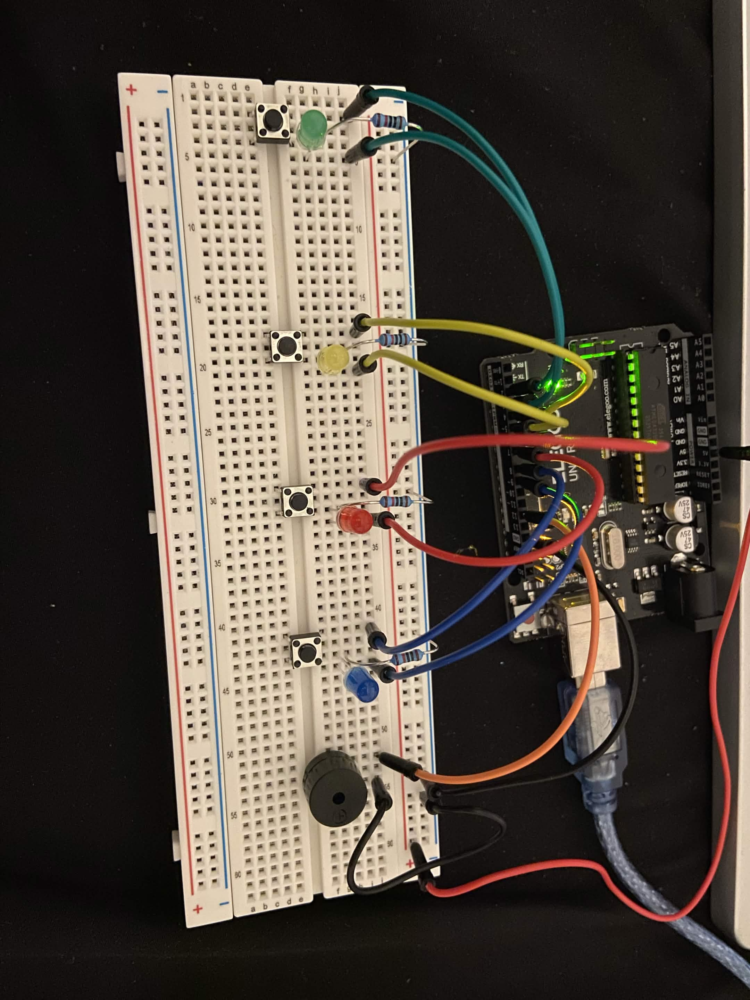

# Memory Game (Simon Says)

A classic "Simon Says" memory game on Arduino UNO R3. The board plays a growing sequence of LED flashes and tones, and you have to repeat it back correctly using the buttons — one mistake ends the game and reports your score.

## How it works

1. Each round, a new random step (0–3) is appended to the growing sequence
2. The full sequence plays back — each step lights its LED and plays a matching tone
3. The player repeats the sequence by pressing the buttons in order, with each press echoed back as its own light + tone
4. If the player matches the whole sequence, a short "level up" jingle plays and the game adds one more step
5. If the player presses the wrong button, a "Game Over" sound and LED flash sequence plays, the score (sequence length reached) is printed to Serial, and the game resets to a new random sequence

Each of the 4 LED/button pairs is mapped to its own musical note, so the sequence is both visual and audible — this doubles as an audio memory test, not just a visual one.

## Demo

## Components

- Arduino UNO R3 (ELEGOO)
- 4x pushbuttons
- 4x LEDs (green, yellow, red, blue)
- 4x current-limiting resistors
- Piezo buzzer/speaker
- Breadboard + jumper wires

## Wiring

| Index | Button Pin | LED Pin | Note |
|---|---|---|---|
| 0 | D2 | D3 | C4 |
| 1 | D4 | D5 | E4 |
| 2 | D6 | D7 | G4 |
| 3 | D8 | D9 | C5 |
| — | — | — | — |
| Speaker | D12 | | |

Buttons use `INPUT_PULLUP`, so each button connects its pin to ground when pressed (no external pull-up/down resistors needed for the buttons themselves).

## Code

See [`src/memory_game.ino`](src/memory_game.ino).

Core logic:
- `gameSequence[]` stores the growing sequence of steps (up to `MAX_GAME_LENGTH`)
- `playSequence()` replays the full sequence so far, lighting each LED and playing its tone
- `readButtons()` blocks until a button press is detected, returning which one
- `checkUserSequence()` compares the player's input against the expected sequence step by step, returning `false` on the first mismatch
- `gameOver()` plays a descending "wah-wah" tone, flashes all LEDs together, prints the final score to Serial, and resets `gameIndex`
- `randomSeed(analogRead(A0))` seeds the random number generator using electrical noise on a floating analog pin, so the sequence is different each time the board resets

## What I'd improve next

- Add persistent high-score tracking with EEPROM, so the best score survives a power cycle
- Add a difficulty option (faster playback speed as levels increase)
- Debounce the buttons in software for more reliable input on rapid presses

## License

MIT
